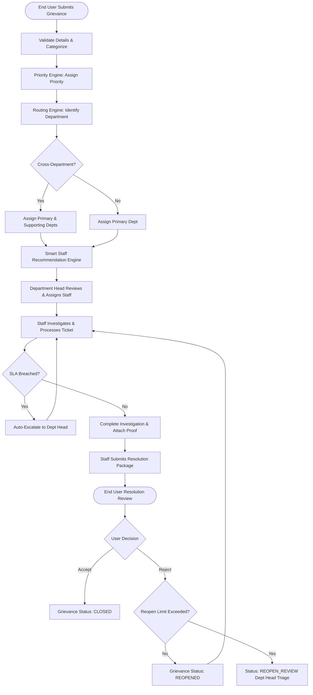

# Grievance Resolution System (GRS)

> A centralized, web-based platform designed for software organizations to manage employee and end-user grievances in a structured, transparent, SLA-driven, and time-bound manner.

[](https://nextjs.org/)
[](https://react.dev/)
[](https://www.typescriptlang.org/)
[](https://tailwindcss.com/)
[](https://biomejs.dev/)
[](#)

---

## 📑 Table of Contents

- [1. Executive Summary](#1-executive-summary)
  - [1.1 Overview](#11-overview)
  - [1.2 Objectives](#12-objectives)
  - [1.3 Core Benefits](#13-core-benefits)
  - [1.4 Module Deliverables](#14-module-deliverables)
  - [1.5 Relationship with Other Modules](#15-relationship-with-other-modules)
  - [1.6 Document Purpose](#16-document-purpose)
- [2. Business Context](#2-business-context)
  - [2.1 Introduction](#21-introduction)
  - [2.2 Business Need Statement](#22-business-need-statement)
  - [2.3 Operational Goals](#23-operational-goals)
  - [2.4 Process Overview](#24-process-overview)
  - [2.5 Stakeholders & Responsibilities](#25-stakeholders--responsibilities)
  - [2.6 High-Level Architecture Context](#26-high-level-architecture-context)
  - [2.7 Dependencies and Integration Points](#27-dependencies-and-integration-points)
  - [2.8 Assumptions & Constraints](#28-assumptions--constraints)
- [3. Actors and Roles](#3-actors-and-roles)
  - [3.1 Overview](#31-overview)
  - [3.2 Primary Roles and Responsibilities](#32-primary-roles-and-responsibilities)
  - [3.3 Secondary / Support Roles](#33-secondary--support-roles)
  - [3.4 Role-Based Access Matrix (RBAC)](#34-role-based-access-matrix-rbac)
  - [3.5 Authentication and Authorization](#35-authentication-and-authorization)
  - [3.6 Role Inheritance Model](#36-role-inheritance-model)
  - [3.7 Access Security Notes](#37-access-security-notes)
- [4. Use Case Narratives](#4-use-case-narratives)
  - [4.1 Use Cases (UC-01 to UC-10)](#41-use-cases-uc-01-to-uc-10)
  - [4.2 Summary of Use Cases](#42-summary-of-use-cases)
- [5. UI Behaviour](#5-ui-behaviour)
  - [5.1 Overview](#51-overview)
  - [5.2 Web Application Interfaces](#52-web-application-interfaces)
  - [5.3 Common UI Elements](#53-common-ui-elements)
- [6. Process and Sequence Flows](#6-process-and-sequence-flows)
  - [6.1 Overview](#61-overview)
  - [6.2 Primary Grievance Resolution Lifecycle Flow](#62-primary-grievance-resolution-lifecycle-flow)
  - [6.3 Priority and Routing Flow](#63-priority-and-routing-flow)
  - [6.4 Smart Staff Recommendation & Assignment Flow](#64-smart-staff-recommendation--assignment-flow)
  - [6.5 SLA Monitoring & Escalation Flow](#65-sla-monitoring--escalation-flow)
  - [6.6 Cross-Department Conflict Flow](#66-cross-department-conflict-flow)
  - [6.7 Resolution & User Review Flow](#67-resolution--user-review-flow)
  - [6.8 Reopen Flow](#68-reopen-flow)
  - [6.9 Audit Flow](#69-audit-flow)
  - [6.10 System Principles](#610-system-principles)
- [7. Entity Relationship Diagram (ERD)](#7-entity-relationship-diagram-erd)
- [8. Technology Stack & Local Setup](#8-technology-stack--local-setup)

---

## 1. Executive Summary

### 1.1 Overview
The **Grievance Resolution System (GRS)** is a centralized, web-based system designed for a software organization to manage employee and end-user grievances in a structured, transparent, and time-bound manner.

The system provides a strictly controlled grievance lifecycle starting from submission and continuing through classification, priority determination, department routing, staff recommendation, assignment, processing, SLA monitoring, escalation, resolution submission, user review, and closure.

The system supports four primary roles:
- **Admin**: Configures system rules, departments, categories, priority rules, SLA rules, routing rules, and escalation rules.
- **Department Head**: Manages grievances within the department, reviews staff recommendations, assigns or overrides assignments, handles department-level escalations, and oversees resolution.
- **Staff**: Works on assigned grievances, performs investigation, records actions taken, and submits the resolution with required details/evidence.
- **End User**: Submits grievances, provides required information, tracks progress, reviews the proposed resolution, and accepts or rejects the resolution.

**Core Operating Flow:**
```
End User Submission → Classification → Priority → Routing → Staff Recommendation → Assignment → Processing → SLA Monitoring → Escalation → Resolution Submission → User Review → Closure / Reopen
```
The design focuses on rule-based decision making, clear ownership, SLA-driven processing, explainable staff recommendations, and controlled resolution closure.

### 1.2 Objectives
1. **Centralize grievance management**: Provide a single, authoritative system for submitting, tracking, processing, and resolving grievances.
2. **Ensure correct grievance routing**: Route grievances to the appropriate department based on configured category, subcategory, and routing rules.
3. **Prioritize grievances consistently**: Use Admin-configured priority rules to determine whether a grievance is *Low*, *Medium*, *High*, or *Critical*.
4. **Improve staff assignment**: Recommend suitable staff members based on configured eligibility and factors such as skills, experience, workload, availability, priority, and SLA risk.
5. **Ensure SLA compliance**: Monitor assignment and resolution timelines and proactively identify grievances approaching or exceeding configured SLAs.
6. **Handle escalation effectively**: Escalate grievances systematically when configured SLA or escalation thresholds are met.
7. **Support cross-department grievances**: Allow a primary department to own a grievance while seamlessly coordinating supporting departments when required.
8. **Ensure proper resolution before closure**: Require staff to submit investigation details, findings, actions taken, outcome, and required evidence before any resolution is presented to the End User.
9. **Provide End User confirmation**: Allow the End User to accept or reject the proposed resolution. A rejected resolution returns the grievance to processing.
10. **Maintain accountability and auditability**: Maintain an immutable audit log recording assignments, escalations, resolution decisions, and user responses throughout the entire lifecycle.

### 1.3 Core Benefits
- **Centralized Grievance Tracking**: All grievances are maintained in one system with real-time status, ownership, priority, SLA tracking, resolution details, and history.
- **Rule-Based Routing and Priority**: Eliminates subjective guesswork through Admin-configured automated evaluation engines.
- **Better Staff Utilization**: Smart Staff Recommendation empowers Department Heads to allocate workloads fairly and effectively based on skills, experience, and current load.
- **SLA-Driven Resolution**: Real-time SLA monitoring flags approaching deadlines and enforces proactive escalations.
- **Controlled Cross-Department Handling**: Eliminates finger-pointing and ownership bottlenecks by defining clear Primary and Supporting department responsibilities.
- **Verified Resolution Workflow**: Prevents premature or unilateral ticket closures by requiring structured evidence submission and explicit End User sign-off.
- **Transparency for End Users**: Real-time visibility into grievance progress, assigned ownership, and resolution timelines.
- **Complete Audit Trail**: Comprehensive traceability for compliance, performance reviews, and organizational audits.

### 1.4 Module Deliverables

| Module / Capability | Key Deliverable |
| :--- | :--- |
| **Grievance Management** | Submission, tracking, status management, and complete grievance history |
| **Category & Subcategory Management** | Configurable hierarchical classification structure |
| **Priority Management** | Admin-configurable rule engine for Low, Medium, High, and Critical priorities |
| **Routing Engine** | Rule-based department identification and automated routing |
| **Cross-Department Handling** | Primary and supporting department management with conflict resolution handling |
| **Smart Staff Recommendation** | Multi-factor score-based recommendation engine for staff assignment |
| **Assignment Management** | Department Head assignment, override mechanisms, and ownership tracking |
| **SLA Management** | Configurable claim/assignment SLAs and processing/resolution SLAs |
| **SLA Monitoring & Escalation** | Early warning triggers, SLA-risk detection, and rule-based escalation |
| **Resolution Management** | Structured investigation logs, findings, actions taken, outcome, and evidence attachments |
| **User Resolution Review** | End User acceptance or rejection portal for proposed resolutions |
| **Reopen Handling** | Lifecycle reopening workflows and reopen-count governance |
| **Audit Management** | Immutable tracking of significant grievance and administrative events |
| **Limited Knowledge Support** | Historical resolution retrieval and curated knowledge candidate generation |

### 1.5 Relationship with Other Modules

```
┌────────────────────────────────────────────────────────┐
│                   GRS Core Module                      │
│ (Submission, Priority, Routing, Processing, Resolution)│
└────────────▲──────────────▲──────────────▲─────────────┘
             │              │              │
 ┌───────────┴────────┐ ┌───┴──────────┐ ┌─┴─────────────┐
 │ Authentication &   │ │ Department & │ │ Notification  │
 │ Authorization (RBAC│ │ User Mgt     │ │ Service       │
 └────────────────────┘ └──────────────┘ └───────────────┘
             │              │              │
 ┌───────────┴────────┐ ┌───┴──────────┐ ┌─┴─────────────┐
 │ Audit Framework    │ │ Knowledge    │ │ Object Storage│
 │ (Traceability Logs)│ │ Support      │ │ (Evidence)    │
 └────────────────────┘ └──────────────┘ └───────────────┘
```

- **Authentication & Authorization**: Enforces role-based security boundaries (Admin, Dept Head, Staff, End User).
- **User & Department Management**: Supplies user profiles, skills inventory, department trees, and organizational hierarchies.
- **Notification Service**: Dispatches instant alerts for assignments, SLA warnings, escalations, resolution reviews, and rejections.
- **Audit Module**: Logs every critical action, assignment modification, escalation trigger, and resolution decision.
- **Knowledge Support**: Indexes accepted resolutions to aid staff in troubleshooting future similar grievances.
- **Storage Service**: Manages secure file uploads for grievance supporting evidence.

### 1.6 Document Purpose
This High-Level Design (HLD) document defines the functional and architectural direction of the Grievance Resolution System. It outlines business context, actor roles, RBAC matrix, use case narratives, UI behavior, process flows, and architectural constraints.

---

## 2. Business Context

### 2.1 Introduction
The Grievance Resolution System (GRS) provides a structured, time-bound mechanism for resolving workplace and service grievances within a software enterprise.

### 2.2 Business Need Statement
Organizations frequently face operational bottlenecks including delayed responses, misrouted grievances, vague ownership, and tickets being closed prematurely without user verification. The GRS resolves these challenges through automated rule-based routing, smart assignment suggestions, rigid SLA controls, and mandatory user verification.

### 2.3 Operational Goals

| Goal | Description |
| :--- | :--- |
| **Accurate Classification** | Classify grievances using configured categories and subcategories. |
| **Correct Prioritization** | Determine Low, Medium, High, or Critical priority using Admin rules. |
| **Effective Routing** | Route grievances to the appropriate primary department without manual triage. |
| **Efficient Assignment** | Recommend suitable staff based on skills, experience, workload, and availability. |
| **SLA Compliance** | Continuously track elapsed times against SLA thresholds. |
| **Controlled Escalation** | Escalate automatically to departmental management when thresholds are breached. |
| **Resolution Quality** | Mandate structured evidence and action reports before presenting solutions. |
| **User Confirmation** | Ensure resolutions are accepted by the complainant before ticket closure. |
| **Traceability** | Maintain a complete historical record of all actions and status transitions. |

### 2.4 Process Overview
1. **Submit Grievance**: End User files grievance with category, subcategory, details, and attachments.
2. **Classify & Prioritize**: Priority Engine assigns priority (*Low*, *Medium*, *High*, *Critical*).
3. **Route Grievance**: Routing Engine assigns Primary Department (and Supporting Department if cross-functional).
4. **Recommend & Assign Staff**: System calculates best-fit Staff score; Department Head confirms or overrides assignment.
5. **Process Grievance**: Staff investigates, logs actions, records findings, and uploads evidence.
6. **Monitor SLA & Escalate**: System calculates risks, sends warnings, and escalates overdue tickets.
7. **Submit & Review Resolution**: Staff submits completed proof of resolution; End User reviews.
8. **Close or Reopen**: Accepted tickets are closed; rejected tickets are reopened with mandatory feedback.
9. **Audit & Traceability**: All transitions are preserved in the immutable audit log.

### 2.5 Stakeholders & Responsibilities

| Stakeholder | Responsibilities | Platform Access |
| :--- | :--- | :--- |
| **Admin** | Configure categories, subcategories, departments, rules (priority, routing, SLA, escalation), and roles. | Admin Console (Web Portal) |
| **Department Head** | Review department queue, monitor SLA/workload, review staff recommendations, assign tickets, handle escalations. | Web Dashboard |
| **Staff** | Investigate assigned grievances, record actions/findings, provide evidence, collaborate cross-departmentally, submit resolutions. | Web Portal (Work Queue) |
| **End User** | Submit grievances, track progress, review proposed resolutions, accept/reject resolutions. | Web Portal / User Interface |

### 2.6 High-Level Architecture Context

| Layer | Component | Description |
| :--- | :--- | :--- |
| **Presentation Layer** | Next.js Web App | Responsive, role-tailored user interfaces with modern UX and glassmorphism styling. |
| **API & Integration Layer** | REST API / Route Handlers | Secure API endpoints with JWT/session authentication, role verification, and request validation. |
| **Application Services** | Core Business Engines | Grievance, Routing, Priority, Recommendation, SLA & Escalation, Resolution, and Notification Services. |
| **Data & Storage Layer** | PostgreSQL & Object Store | Relational persistence for grievances, SLA counters, rules, and audit logs; secure bucket for attachments. |
| **Dashboard / Reporting** | Analytics & Reporting | Visual metric cards, SLA-risk tables, workload charts, and audit inspection tools. |

### 2.7 Dependencies and Integration Points
- **User & Role Management (Core)**: Account authentication, roles, and capability records.
- **Department Management (Core)**: Department hierarchies, head assignments, and routing keys.
- **Notification Service (Shared)**: Real-time alerts (email/in-app) on state changes and SLA breaches.
- **Audit Framework (Shared)**: Tamper-proof logging for compliance and governance.
- **Reporting Service (Shared)**: Operational insights, SLA adherence metrics, and staff throughput.
- **Storage Service (Shared)**: Encrypted file store for grievance documentation and resolution evidence.
- **Cross-Department Collaboration (Shared)**: Shared communication channels between collaborating departments.

### 2.8 Assumptions & Constraints
- Scoped to a single software enterprise organization.
- Supports four primary roles: Admin, Department Head, Staff, and End User.
- Primary department retains ultimate grievance ownership; supporting departments assist in collaborative mode.
- SLA durations, warning percentages, and escalation triggers are fully dynamic and Admin-configurable.

---

## 3. Actors and Roles

### 3.1 Overview
The GRS enforces strict Role-Based Access Control (RBAC). Users access only the data and functionality matching their assigned organizational role.

### 3.2 Primary Roles and Responsibilities
- **Admin**: Overall system administrator and governance owner.
- **Department Head**: Manager of departmental staff, workload balancer, escalation responder.
- **Staff**: Operational problem-solver, investigator, and resolution provider.
- **End User**: Grievance creator and resolution reviewer.

### 3.3 Secondary / Support Roles
Authentication, notification dispatching, background audit writers, and file storage handlers run as specialized system services.

### 3.4 Role-Based Access Matrix (RBAC)

| Function | Admin | Department Head | Staff | End User |
| :--- | :---: | :---: | :---: | :---: |
| **Submit Grievance** | ✓ | ✓ | ✓ | ✓ |
| **View Own Grievances** | ✓ | ✓ | ✓ | ✓ |
| **View Department Grievances** | ✓ | ✓ | — | — |
| **Manage Categories & Subcategories** | ✓ | — | — | — |
| **Configure Priority Rules** | ✓ | — | — | — |
| **Configure Routing Rules** | ✓ | — | — | — |
| **Configure SLA Rules** | ✓ | — | — | — |
| **Configure Escalation Rules** | ✓ | — | — | — |
| **View Staff Recommendations** | ✓ | ✓ | — | — |
| **Assign Grievance / Override** | ✓ | ✓ | — | — |
| **Process Grievance & Record Findings**| ✓ | ✓ | ✓ | — |
| **Submit Resolution with Evidence** | ✓ | ✓ | ✓ | — |
| **Accept Resolution** | — | — | — | ✓ |
| **Reject Resolution & Reopen** | — | — | — | ✓ |
| **View Audit History** | Full | Department | Limited | Own Grievance |

### 3.5 Authentication and Authorization
- Centralized authentication via secure tokens/sessions.
- Granular authorization checks at both API endpoint level and UI route level.
- Multi-tenant department isolation ensuring staff cannot access grievances outside their assignment/department.

### 3.6 Role Inheritance Model

| Inheritance Rule | Description |
| :--- | :--- |
| **Admin** | Inherits system-wide superuser privileges across all departments and configuration tiers. |
| **Department Head** | Department-scoped oversight with assignment authority and escalation management. |
| **Staff** | Ticket-scoped execution rights for investigation, action recording, and resolution submission. |
| **End User** | Ownership-scoped access restricted to submitted grievances and resolution acceptance/rejection. |

### 3.7 Access Security Notes
- Least privilege access enforced at the database and API query levels.
- Strict MIME-type checking, virus scanning, and storage encryption for evidence attachments.
- Tamper-evident logging of all configuration overrides and reassignment events.

---

## 4. Use Case Narratives

### 4.1 Use Cases (UC-01 to UC-10)

#### UC-01 — Submit Grievance
- **Primary Actor**: End User
- **Description**: End User registers a grievance with mandatory metadata (category, subcategory, title, description, attachments).
- **Flow**: User inputs details → System validates → Unique Grievance ID generated → Automated classification & routing triggered.
- **Outcome**: Grievance enters the processing pipeline with initial status `SUBMITTED`.

#### UC-02 — Determine Grievance Priority
- **Primary Actor**: System / Admin
- **Description**: Evaluates grievance parameters against Admin rules to assign *Low*, *Medium*, *High*, or *Critical*.
- **Flow**: Priority Engine processes submission attributes → Matches configured rule criteria → Falls back to configured Default Priority if unmatched → Attaches priority and initial SLA timer.
- **Outcome**: Grievance priority assigned.

#### UC-03 — Route Grievance
- **Primary Actor**: System / Admin
- **Description**: Determines responsible department(s) using configured routing rules.
- **Flow**: Routing Engine evaluates classification → Identifies Primary Department (and optional Supporting Department) → Places ticket in departmental queue (or routes to Exception Review if ambiguous).
- **Outcome**: Clear department ownership established.

#### UC-04 — Recommend and Assign Staff
- **Primary Actor**: Department Head
- **Description**: Smart engine suggests top staff candidates based on skills, experience, workload, availability, and SLA risk.
- **Flow**: Dept Head opens unassigned ticket → System presents ranked staff list with explainability score → Dept Head accepts recommendation or selects alternate staff → Assignment logged.
- **Outcome**: Ticket moves to `ASSIGNED` state under specific staff ownership.

#### UC-05 — Process Grievance
- **Primary Actor**: Staff
- **Description**: Staff investigates the issue and records incremental progress.
- **Flow**: Staff opens assigned item → Reviews context → Investigates root cause → Logs actions, findings, and temporary notes → Collaborates with supporting departments if needed.
- **Outcome**: Status updated to `IN_PROGRESS`.

#### UC-06 — Monitor SLA and Escalate
- **Primary Actor**: System / Department Head
- **Description**: Proactively monitors SLA countdowns and executes escalations upon threshold violation.
- **Flow**: SLA Service monitors elapsed time → Triggers warning notifications at 75% threshold → Triggers escalation at 100% breach → Elevates ticket priority/status to `ESCALATED` and alerts Department Head.
- **Outcome**: At-risk or breached tickets receive management intervention.

#### UC-07 — Submit Resolution
- **Primary Actor**: Staff
- **Description**: Staff submits comprehensive resolution package with proof of work.
- **Flow**: Staff enters investigation summary, root-cause findings, corrective action taken, and uploads supporting evidence → System validates required fields → Status transitions to `RESOLVED` / `PENDING_USER_REVIEW`.
- **Outcome**: Resolution presented to End User for sign-off.

#### UC-08 — Review Resolution
- **Primary Actor**: End User
- **Description**: End User verifies whether the proposed resolution solved their grievance.
- **Flow**: User receives alert → Reviews resolution summary & evidence → Selects **Accept** or **Reject**.
  - **Accept**: Status moves to `CLOSED`.
  - **Reject**: User supplies mandatory rejection reason → Status moves to `REOPENED`.
- **Outcome**: Final closure or loopback to investigation.

#### UC-09 — Handle Cross-Department Conflict
- **Primary Actor**: Department Head / Admin
- **Description**: Resolves ownership disputes when a grievance spans multiple business units.
- **Flow**: Routing conflict detected → Ticket flagged for manual triage → Admin/Dept Head determines Primary Owner and Supporting Departments → Tasks partitioned.
- **Outcome**: Ambiguity eliminated; collaborative processing initiated.

#### UC-10 — Reopen Grievance
- **Primary Actor**: End User
- **Description**: Enables user to dispute resolution within permitted limits.
- **Flow**: User rejects resolution with remarks → System checks current reopen count against max limit → Reopens ticket for Staff corrective action (or moves to `REOPEN_REVIEW` if max reopens reached).
- **Outcome**: Controlled reassessment with full historical context.

### 4.2 Summary of Use Cases

| Use Case ID | Use Case Name | Primary Actor | Trigger / Purpose |
| :--- | :--- | :--- | :--- |
| **UC-01** | Submit Grievance | End User | Initiates new grievance ticket |
| **UC-02** | Determine Priority | System | Calculates Low, Medium, High, Critical |
| **UC-03** | Route Grievance | System | Assigns Primary/Supporting Department |
| **UC-04** | Recommend & Assign Staff | Department Head | Smart scoring & staff workload allocation |
| **UC-05** | Process Grievance | Staff | Investigation, action logs, root-cause finding |
| **UC-06** | Monitor SLA & Escalate | System / Dept Head | Breach prevention and automatic escalation |
| **UC-07** | Submit Resolution | Staff | Records findings, actions taken, and evidence |
| **UC-08** | Review Resolution | End User | User confirmation (Accept / Reject) |
| **UC-09** | Cross-Dept Conflict | Dept Head / Admin | Department ownership resolution |
| **UC-10** | Reopen Grievance | End User | Returns ticket for corrective investigation |

---

## 5. UI Behaviour

### 5.1 Overview
The GRS frontend provides role-scoped web portals with tailored views, strict security controls, and responsive workflows.

### 5.2 Web Application Interfaces

#### 5.2.1 Dashboard (Admin / Department Head View)
- **Admin Dashboard**: Real-time KPI cards (Total, Open, Escalated, Overdue), breakdown by priority, category distribution, cross-department metrics, and system audit logs.
- **Department Head Dashboard**: Department-specific work queue, unassigned ticket alerts, staff workload balance charts, high-priority SLA risks, and escalation management.

#### 5.2.2 Grievance Submission Screen (End User)
- Categorized dropdowns with dynamic subcategories.
- Rich-text description box, severity indicator, and multi-file drag-and-drop attachment area.
- Instant submission confirmation with unique tracking ID.

#### 5.2.3 Grievance Details & Tracking Screen
- Live status pill (`SUBMITTED`, `ASSIGNED`, `IN_PROGRESS`, `RESOLVED`, `CLOSED`, `REOPENED`, `ESCALATED`).
- Visual progress timeline mapping every milestone from creation to closure.
- Department ownership badge, assigned staff contact, SLA remaining counter, and resolution preview.

#### 5.2.4 Department Head Assignment Screen
- Unassigned queue with one-click recommendation preview.
- Staff scoring breakdown matrix: Skill match %, current active tickets, availability status, and past SLA performance.
- One-click assign button with manual override modal.

#### 5.2.5 Staff Work Queue
- Prioritized task view filtered by assigned staff.
- Color-coded SLA countdown timers (Green = Safe, Amber = Warning, Red = Breach).
- Quick-action drawer for logging progress notes and triggering department collaboration.

#### 5.2.6 Resolution Submission Screen
- Structured mandatory form fields:
  - Investigation Details & Root Cause Analysis
  - Corrective & Preventative Actions Taken
  - Final Outcome Summary
  - Mandatory Evidence / Supporting Documents Upload

#### 5.2.7 Admin Configuration Screens
- Department & category management table.
- Visual rule builder for Priority matching, Routing logic, SLA time allocations, and Multi-tier Escalation policies.

#### 5.2.8 Resolution Review Screen (End User)
- Clear comparison between original grievance issue and proposed resolution.
- Downloadable resolution evidence attachments.
- Binary decision buttons: **Accept Resolution** (triggers satisfaction rating) vs. **Reject Resolution** (opens mandatory reason textarea).

### 5.3 Common UI Elements
- Role-aware sidebar navigation and header profile switch.
- Universal search bar and multi-filter drawers (Status, Priority, Department, Date Range).
- Live toast notifications for assignments and SLA alerts.
- Accessible tables with pagination, sorting, and export capabilities.

---

## 6. Process and Sequence Flows

### 6.1 Overview
The GRS enforces predictable, state-driven lifecycle flows from ticket inception to final resolution.

### 6.2 Primary Grievance Resolution Lifecycle Flow



### 6.3 Priority and Routing Flow
```
Grievance Submission
       │
       ▼
Priority Rules Engine ───► [Low | Medium | High | Critical]
       │
       ▼
Routing Rules Engine ────► Primary Department
       │
       └─────────────────► Supporting Department (Optional / Cross-functional)
```

### 6.4 Smart Staff Recommendation & Assignment Flow

Staff candidates are evaluated and ranked dynamically using a multi-factor scoring model:

| Factor | Weight / Purpose |
| :--- | :--- |
| **Required Skills** | Matches required technical/functional skills with staff profile competencies. |
| **Relevant Experience**| Rewards past successful resolutions in the same category/subcategory. |
| **Current Workload** | Penalizes staff with high volumes of active tickets to prevent burnout. |
| **Availability** | Confirms active working status and excludes staff on planned leave. |
| **Grievance Priority** | Directs Critical/High tickets to senior, experienced staff. |
| **SLA Risk Factor** | Evaluates remaining capacity against urgent delivery timelines. |

```
Eligible Staff Pool ──► Multi-Factor Ranking Engine ──► Explainable Top-3 Recommendations ──► Dept Head Review ──► Final Assignment Logged
```

### 6.5 SLA Monitoring & Escalation Flow
- **Stage 1 (Normal)**: SLA timer running; normal monitoring.
- **Stage 2 (Warning Threshold - 75%)**: Amber alert dispatched to assigned staff and Dept Head.
- **Stage 3 (Breach Threshold - 100%)**: Ticket marked `ESCALATED`; high-priority notification to Dept Head; required action logged in audit history.

### 6.6 Cross-Department Conflict Flow
- When multiple departments are impacted, Routing Engine nominates a **Primary Owner** with one or more **Supporting Departments**.
- If department boundaries are contentious, the ticket is routed to **Triage Review** where an Admin or Senior Head fixes ownership before processing begins.

### 6.7 Resolution & User Review Flow
```
Staff Completes Investigation
           │
           ▼
Record Details, Findings, Actions & Upload Evidence
           │
           ▼
Submit Resolution Form
           │
           ▼
End User Review Notification
     │               │
  [Accept]        [Reject]
     │               │
     ▼               ▼
   CLOSED     Mandatory Reason ──► REOPENED
```

### 6.8 Reopen Flow
```
User Rejection with Reason
           │
           ▼
Check Current Reopen Count vs. Configured Max Limit
           │
     ┌─────┴────────────────────────┐
     ▼                              ▼
Within Limit                 Limit Exceeded
     │                              │
     ▼                              ▼
Status: REOPENED             Status: REOPEN_REVIEW
Returned to Staff            Escalated to Dept Head
Revised Resolution Flow      Administrative Final Review
```

### 6.9 Audit Flow
Every state change, manual assignment override, priority reassessment, SLA breach, resolution submission, and user rejection generates an immutable audit record containing:
- **Timestamp (UTC)**
- **Actor ID & Role**
- **Action Type**
- **Previous Value ➔ New Value**
- **IP Address & Client Metadata**

### 6.10 System Principles
1. **Defined Lifecycle**: Every grievance is bound to explicit, valid status states.
2. **Deterministic Rules**: Priority and routing are driven by Admin configuration, not arbitrary choices.
3. **Single Point of Primary Accountability**: Exactly one primary department owns the ticket at all times.
4. **Transparent Recommendations**: Staff recommendations are accompanied by explainable scoring factors.
5. **No Blind Closures**: No ticket can reach `CLOSED` status without explicit End User acceptance or formal administrative sign-off.

---

## 7. Entity Relationship Diagram (ERD)

### 7.1 High-Level ERD Overview
The core relational data schema links Users, Roles, Departments, Grievances, Attachments, SLA Timers, Resolutions, and Audit Logs:

```
[Users] ──────< [Roles]
   │
   ├──────< [Departments]
   │             │
   │             ▼
   └───────< [Grievances] >─────── [GrievanceCategories]
                 │       \
                 │        \─────< [GrievanceAttachments]
                 ├──────────────< [SLATrackers]
                 ├──────────────< [Resolutions] >──── [ResolutionEvidence]
                 └──────────────< [AuditLogs]
```

### 7.2 Detailed ERD
Explore the complete schema, foreign keys, table indexes, and constraints:
- 🔗 **[View Detailed ERD Diagram](https://sl1nk.com/p9vksfr)**

---

## 8. Technology Stack & Local Setup

### 8.1 Technology Stack
- **Framework**: [Next.js 16 (App Router)](https://nextjs.org/)
- **UI Library**: [React 19](https://react.dev/)
- **Styling**: [Tailwind CSS v4](https://tailwindcss.com/)
- **Language**: [TypeScript 5](https://www.typescriptlang.org/)
- **Linter & Formatter**: [Biome](https://biomejs.dev/)
- **Git Hooks**: [Husky](https://typicode.github.io/husky/) & [lint-staged](https://github.com/lint-staged/lint-staged)
- **Database**: PostgreSQL (Prisma / Drizzle ORM ready)

### 8.2 Project Structure
```text
GRS/
├── .husky/              # Git commit & pre-push hooks
├── .vscode/             # Editor settings & launch configurations
├── public/              # Static assets & icons
├── src/
│   └── app/
│       ├── favicon.ico
│       ├── globals.css  # Tailwind & custom CSS variables
│       ├── layout.tsx   # Root layout & providers
│       └── page.tsx     # Landing / entry page
├── AGENTS.md            # Agent & framework guidelines
├── biome.json           # Biome linter/formatter configuration
├── next.config.ts       # Next.js build configuration
├── package.json         # Dependencies & execution scripts
├── pnpm-lock.yaml       # Pnpm lockfile
└── tsconfig.json        # TypeScript configuration
```

### 8.3 Getting Started Locally

#### Prerequisites
- **Node.js**: `v20.x` or higher
- **Package Manager**: `pnpm` (recommended), `npm`, or `bun`

#### Installation & Development

1. **Clone the repository:**
   ```bash
   git clone <repository-url>
   cd GRS
   ```

2. **Install dependencies:**
   ```bash
   pnpm install
   # or: npm install
   ```

3. **Run the local development server:**
   ```bash
   pnpm dev
   # or: npm run dev
   ```

4. Open [http://localhost:3000](http://localhost:3000) in your browser.

#### Scripts & Quality Assurance

| Command | Description |
| :--- | :--- |
| `pnpm dev` | Starts the Next.js development server |
| `pnpm build` | Compiles the production build |
| `pnpm start` | Runs the compiled production server |
| `pnpm lint` | Runs Biome code analysis |
| `pnpm format` | Formats code with Biome |
| `pnpm check` | Runs Biome check and applies safe fixes |
| `pnpm typecheck` | Validates TypeScript types across the codebase |

---

## 9. License & Governance
Proprietary software for internal enterprise use. All rights reserved.
